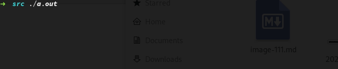
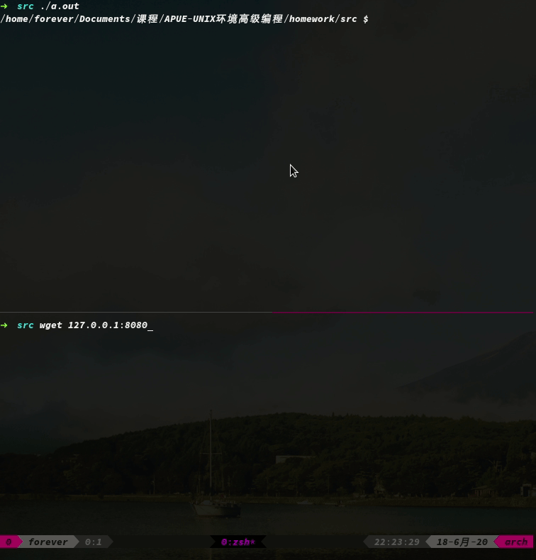
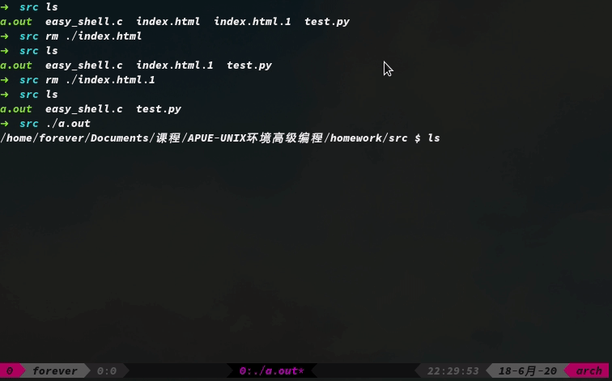

# 命令解释器

这是`UNIX环境高级编程的期末作业`，完成了几个简单的任务要求。该作业主要是在UNIX环境高级编程Figure 1.10的基础上更改的，Figure 1.10代码：

```c
#include "apue.h"
#include <sys/wait.h>

static void sig_int(int);     /* our signal-catching function */

int main(void) {
    char   buf[MAXLINE];      /* from apue.h */
    pid_t  pid;
    int    status;
    
    if (signal(SIGINT, sig_int) == SIG_ERR)
        err_sys("signal error\n");
    
    printf("%% ");
    while (fgets(buf, MAXLINE, stdin) != NULL) {
        if (buf[strlen(buf) - 1] == '\n')
            buf[strlen(buf - 1)] = 0；/* replace new line with null */
        if ((pid = fork()) < 0) {
            err_sys("fork error");
        } else if (pid == 0) { /* child */
            execlp(buf, buf, (char *)0);
            err_ret("couldn't execute: %s", buf);
            exit(127);
        }
        
        if ((pid == waitpid(pid, &status, 0)) < 0) /* parent */
            err_sys("waitpid error");
        printf("%% ");
    }
    exit(0);
}

void sig_int(int signo) {
    printf("interrupt\n %% ");
}
```

## 1. 功能

1. 程序从控制台执行,启动后显示一个命令提示符。例如 “->”。用户可以通过给特定的环境变量赋值来改变命令提示符的形式;
2. 通过某个特殊的命令或按键组合可以正常地关闭本程序;
3. 提供后台运行机制。用户提交的任务可以通过某种指示使之在后台运行,例如:-> bg job1 \<CR>将使任务 job1 在后台运行,并马上返回给用户一个新的提示符;
4. 提供输出重定向。通过指定文件名将任务的所有输出覆盖写到文件中而不是送到标准输出上;
5. 提供输入重定向。通过指定文件名使得任务从相应的文件中去获取所需的数据,而不是从标准输入上。

## 2. 运行

直接进入src目录，执行如下命令进行编译，获得可执行文件，然后直接运行可执行文件即可：

```bash
gcc ./easy_shell.c
```

## 3. 运行截图

#### 3.1 用户更改命令提示符

默认命令提示符是`$`


在控制台，我们通过改变环境变量`promot`来更改命令解释器的提示符，如下操作：

```bash
export promot="->"
```

接下来在控制台执行我们的命令解释器，可以发现提示符更改了：



#### 3.2 使用命令关闭命令解释器

使用`exit`命令可以关闭命令解释器：


#### 3.3 后台运行

使用`bg`命令可以让程序在后台执行，为了可以判断程序正确在后台运行，我们使用src文件夹下的test.py文件来做测试，该文件是一个简单的服务器，监控本地的8080端口，在后台运行时，依旧可以获取请求。

首先，我们在前台运行test.py，可以发现使用wget可以获得test.py的输出，接下来我们使用ctrl c快捷键终止掉在前台运行的test.py程序，此时使用wget无法获得结果，然后我们使用bg命令让test.py在后台运行，可以发现此时wget可以获得test.py的输出了，而且命令解释器依旧可以执行其他的命令。



#### 3.4 重定向

重定向包括输入重定向和输出重定向，使用重定向必须满足两个条件，第一重定向符号`>`和`<`与其他参数之间必须要有空格，第二重定向符号后面必须跟有重定向文件。



## 4. 总结

该命令解释器仅仅完成了作业中的5个简单需求而且很不完善，尤其是在多后台任务那部分，如果有多个后台任务同时进行，那么其中一个在后台退出的话，我并没有记录该进程是否退出，我目前仅仅是使用一个全局数组来保存所有后台任务的pid，而且该数组只能增加不能减少，因为数组对于减少的操作比较繁琐，这是要改进的地方。

对于此，我想到的一个方案是使用链表，记录每个后台pid，当后台进程结束的时候从链表中拿掉该节点，在命令解释器退出的时候结束所有存在的节点，但是这样就存在一个检索问题，在后台进程结束的时候，需要遍历链表才能找到该后台进程的节点，因此我想到了可以使用哈希表的方法，每个pid进行一次哈希，得到存储地址，如果进程结束了，那么该地址就存储0，否则该地址存储1，但是存储1或者0对命令解释器退出的时候结束全部的后台进程不友好，我们无从得知到底该位置对应的是哪个进程，所以我觉得未结束的后台进程应该直接存储pid，而结束掉的后台进程直接存储0，这样在命令解释器退出的时候，可以直接遍历哈希表非0值，结束所有的后台进程。

当然，能力有限，对于该问题，我暂时只想到这个解决方案。